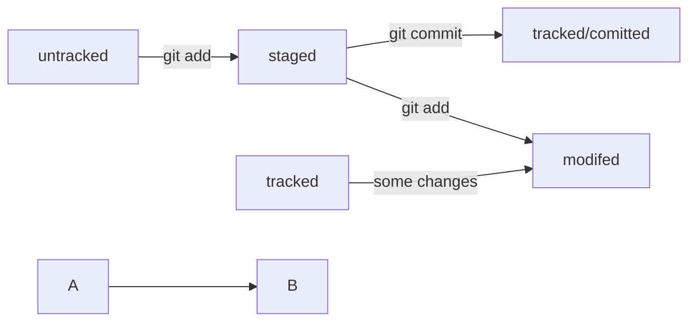

# Git для начинающих

# Не большая шпаргалка для начинающих

**pwd** - вывод текущей рабочей директории, можно использовать команду.
**cd** - переход к определенной директории например:

```bash
cd ~ #пеоеход в домашнуюю директорию
```

Вывести содержимое директории — ls (от англ. list directory contents — «отобразить содержимое директории»

## У многих команд консоли есть дополнительные опции. Например, если вы вызовете ls, то увидите список обычных файлов в директории. Но можно вызвать ls с флагом -a и вывести расширенный список. В нём отобразятся все скрытые файлы, которые начинаются с символа . (например, файлы конфигурации). В том числе два особых файла . и .., которые обозначают текущую и родительскую директории.

```bash
$ ls # вывели список файлов
file.txt
photo.png

$ ls -a # вывели список, в котором отображаются скрытые файлы ., .. и .git
.
..
.git
file.txt
photo.png
```

## Операции с папками и файлами: создание, копирование, перемещение

### Создание файлов и директорий — touch, mkdir

Чтобы создать файл, нужно ввести в консоль команду touch (англ. «коснуться») с именем файла в качестве параметра: touch %ИМЯ_ФАЙЛА%.

```bash
$ touch my-new-file.txt # создали файл my-new-file.txt
```

### Для создания директорий через терминал используют другую команду — mkdir (от англ. make directory — «создать директорию»).

```bash
$ mkdir new-dir # создали директорию new-dir
```

По умолчанию `touch` и `mkdir` создают файлы и папки в текущей рабочей директории. Например, если вы находитесь в директории `abs`, команда `touch file.txt` создаст файл именно там: `abs/file.txt`.

Также можно использовать обе команды вместе с символом домашней директории (`~`) или родительской директории (`..`). Например, команда `mkdir ~/my-git-projects` создаст папку `my-git-projects` внутри домашней директории.

А команда `touch ../../file.txt` создаст файл `file.txt` на две папки выше по иерархии. Допустим, если вы находитесь в директории `projects/git/hello`, команда `touch ../../file.txt` создаст файл по такому пути: `projects/file.txt`.

### Копирование файлов — cp

Для копирования файлов через терминал существует команда cp (от англ. copy — «копировать»). В простом виде cp принимает два параметра: что копируем и куда копируем.

```bash
$ cp что_копируем куда_копируем

$ cp index.html src/
# скопировали index.html в папку src
```

#### Но можно указать сразу несколько файлов.

```bash
$ cp что_копируем что_копируем что_копируем куда_копируем

$ cp index.html style.css script.js src/
# скопировали три файла (index.html, style.css и script.js) в папку src
```

## Операции с папками и файлами: чтение и удаление

### Чтение файлов — cat

Чтобы прочитать файл, в консоль нужно ввести cat (от англ. concatenate and print — «объединить и распечатать») вместе с именем файла. Команда распечатает то, что содержится в нём.

```bash
$ cat myfile.txt # распечатали содержимое файла myfile.txt
file-content-1
file-content-2
```

Команда cat работает только с текстовыми файлами. Вывести этой командой файл другого типа (например, изображение) не получится.

### Удаление файлов и папок — rm, rmdir, rm -r

Чтобы удалить файл, нужно напечатать команду rm (от англ. remove — «удалить») и передать ей имя файла.

```bash
Чтобы удалить файл, нужно напечатать команду rm (от англ. remove — «удалить») и передать ей имя файла.
```

---

HEAD -- это голова.
Коммит -- это всему голова.
Статусы файлов:
<тут пустая строка!>

<и тут пустая строка!>


